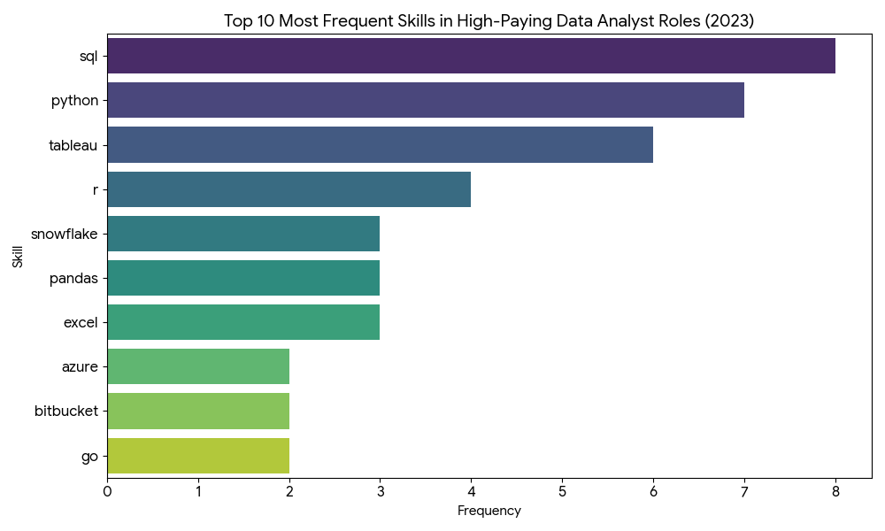

# Introduction  
📊 Dive into the data analyst job market! This project is a deep-dive SQL analysis focused on uncovering 💰 top-paying roles, 🔥 in-demand skills, and 📈 where high demand meets high salary — all from the perspective of a job seeker trying to break into or advance in data analytics.  
🔍 SQL queries? Check them out here:  [project_sql folder](/project_sql/)  

# Background  
Driven by a desire to navigate the data analyst job market strategically, this project was built to answer real questions that job seekers face: *Which skills should I learn? Where are the best-paying opportunities? What do top companies actually look for?*
 
Following along with [Luke Barousse's SQL Course](https://lukebarousse.com/sql), the dataset includes rich information on job titles, salaries, locations, and required skills from real job postings.  

### The questions I wanted to answer through my SQL queries:
 
1. What are the top-paying data analyst jobs?
2. What skills are required for these top-paying jobs?
3. What skills are most in demand for data analysts?
4. Which skills are associated with higher salaries?
5. What are the most optimal skills to learn?  


# Tools I used  
For this deep dive into the data analyst job market, I used the following tools:
 
- **SQL:** The backbone of my analysis — used to query the database and extract meaningful insights.
- **PostgreSQL:** The database management system used to store and manage all job posting data.
- **Visual Studio Code:** My primary environment for writing and executing SQL queries.
- **Git & GitHub:** Used for version control and sharing my work, keeping everything organized and trackable.

# The Analysis  
Each query was designed to answer a specific question about the data analyst job market. Here's how I approached each one:
 
### 1. Top Paying Data Analyst Jobs
To find the highest-paying roles, I filtered for remote data analyst positions with non-null salaries and sorted by average yearly salary.
 
```sql
SELECT 
    job_id,
    job_title,
    job_location,
    job_schedule_type,
    salary_year_avg,
    job_posted_date,
    name AS company_name

FROM 
    job_postings_fact
LEFT JOIN company_dim on job_postings_fact.company_id = company_dim.company_id
WHERE 
    job_title_short = 'Data Analyst' AND
    job_location = 'Anywhere' AND
    salary_year_avg IS NOT NULL
ORDER BY 
    salary_year_avg DESC
LIMIT 10;
```
 
Key takeaways:
- **Wide Salary Range:** The top 10 roles span from $184,000 to $600,000, showing massive earning potential.
- **Diverse Employers:** Companies like SmartAsset, Meta, and AT&T appear, reflecting demand across industries.
- **Varied Job Titles:** From Data Analyst to Director of Analytics, titles vary widely, showing many paths within the field.  

*Bar graph visualizing the top 10 salaries for data analysts; ChatGPT generated this graph from my SQL query results.*  

### 2. Skills for Top Paying Jobs
I joined job postings with skills data to see what skills are most common among the highest-compensated roles.
 
```sql
WITH top_paying_jobs AS (
    SELECT 
        job_id,
        job_title,
        salary_year_avg,
        name AS company_name

    FROM 
        job_postings_fact
    LEFT JOIN company_dim on job_postings_fact.company_id = company_dim.company_id
    WHERE 
        job_title_short = 'Data Analyst' AND
        job_location = 'Anywhere' AND
        salary_year_avg IS NOT NULL
    ORDER BY 
        salary_year_avg DESC
    LIMIT 10
)
SELECT top_paying_jobs.*,
        skills
FROM top_paying_jobs
INNER JOIN skills_job_dim on top_paying_jobs.job_id = skills_job_dim.job_id
INNER JOIN skills_dim on skills_job_dim.skill_id = skills_dim.skill_id
ORDER BY 
    salary_year_avg DESC 
;
```
 
Key takeaways:
- **SQL** appears in 8 of the top 10 roles — it's non-negotiable.
- **Python** follows closely, appearing in 7 roles.
- **Tableau** is highly sought after, appearing in 6 roles.
- Tools like **R**, **Snowflake**, **Pandas**, and **Excel** also show up frequently.

*Bar graph showing skill frequency across the top 10 paying data analyst jobs; ChatGPT generated this graph.*  

### 3. In-Demand Skills for Data Analysts
This query identifies which skills appear most often in job postings — helping prioritize what to learn first.
 
```sql
SELECT 
    skills,
    COUNT(skills_job_dim.job_id) AS demand_count
FROM job_postings_fact
INNER JOIN skills_job_dim on job_postings_fact.job_id = skills_job_dim.job_id
INNER JOIN skills_dim on skills_job_dim.skill_id = skills_dim.skill_id
WHERE 
    job_title_short = 'Data Analyst'
GROUP BY skills
ORDER BY demand_count DESC 
LIMIT 5;
```
 
| Skills   | Demand Count |
|----------|--------------|
| SQL      | 92628        |
| Excel    | 67031        |
| Python   | 57326        |
| Tableau  | 46554        |
| Power BI | 39468        |
 
*Top 5 most in-demand skills in data analyst job postings.*
 
Key takeaways:
- **SQL** and **Excel** remain the foundation — mastering these is essential.
- **Python**, **Tableau**, and **Power BI** show that technical and visualization skills are increasingly expected.  

### 4. Skills Based on Salary
Here I looked at average salaries associated with each skill to find out which ones command the highest pay.
 
```sql
SELECT 
    skills,
    ROUND(AVG(salary_year_avg), 0) AS avg_salary
FROM job_postings_fact
INNER JOIN skills_job_dim ON job_postings_fact.job_id = skills_job_dim.job_id
INNER JOIN skills_dim ON skills_job_dim.skill_id = skills_dim.skill_id
WHERE
    job_title_short = 'Data Analyst'
    AND salary_year_avg IS NOT NULL
    AND job_work_from_home = True 
GROUP BY
    skills
ORDER BY
    avg_salary DESC
LIMIT 25;
```
 
| Skills        | Average Salary ($) |
|---------------|-------------------:|
| pyspark       |            208,172 |
| bitbucket     |            189,155 |
| couchbase     |            160,515 |
| watson        |            160,515 |
| datarobot     |            155,486 |
| gitlab        |            154,500 |
| swift         |            153,750 |
| jupyter       |            152,777 |
| pandas        |            151,821 |
| elasticsearch |            145,000 |
 
*Top 10 highest-paying skills for data analysts.*
 
Key takeaways:
- **Big Data & ML tools** (PySpark, DataRobot, Jupyter) top the salary charts.
- **DevOps-adjacent skills** (GitLab, Kubernetes, Airflow) indicate a well-paying crossover between data and engineering.
- **Cloud expertise** (Elasticsearch, Databricks, GCP) continues to drive earning potential upward.  

### 5. Most Optimal Skills to Learn
This final query combines demand and salary to find the sweet spot — skills that are both frequently requested *and* well-compensated.
 
```sql
WITH skills_demand AS (
    SELECT 
    skills_dim.skill_id,
    skills_dim.skills,
    COUNT(skills_job_dim.job_id) AS demand_count
FROM job_postings_fact
INNER JOIN skills_job_dim on job_postings_fact.job_id = skills_job_dim.job_id
INNER JOIN skills_dim on skills_job_dim.skill_id = skills_dim.skill_id
WHERE 
    job_title_short = 'Data Analyst' AND
    salary_year_avg IS NOT NULL 
    AND job_work_from_home = TRUE
GROUP BY skills_dim.skill_id
),
 average_salary AS (
    SELECT 
    skills_job_dim.skill_id,
    Round(AVG(salary_year_avg), 0) AS avg_salary
FROM job_postings_fact
INNER JOIN skills_job_dim on job_postings_fact.job_id = skills_job_dim.job_id
INNER JOIN skills_dim on skills_job_dim.skill_id = skills_dim.skill_id
WHERE 
    job_title_short = 'Data Analyst' AND
    salary_year_avg IS NOT NULL 
    AND job_work_from_home = TRUE
GROUP BY skills_job_dim.skill_id
)
SELECT 
    skills_demand.skill_id,
    skills_demand.skills,
    demand_count,
    avg_salary
FROM skills_demand
INNER JOIN average_salary on skills_demand.skill_id = average_salary.skill_id
ORDER BY demand_count DESC
LIMIT 25;
```
 
| Skill ID | Skills     | Demand Count | Average Salary ($) |
|----------|------------|--------------|-------------------:|
| 8        | go         | 27           |            115,320 |
| 234      | confluence | 11           |            114,210 |
| 97       | hadoop     | 22           |            113,193 |
| 80       | snowflake  | 37           |            112,948 |
| 74       | azure      | 34           |            111,225 |
| 77       | bigquery   | 13           |            109,654 |
| 76       | aws        | 32           |            108,317 |
| 4        | java       | 17           |            106,906 |
| 194      | ssis       | 12           |            106,683 |
| 233      | jira       | 20           |            104,918 |
 
*Most optimal skills for data analysts, ranked by salary.*
 
Key takeaways:
- **Python and R** are in high demand (236 and 148 postings) with solid average salaries around $100K+.
- **Cloud platforms** like Snowflake, Azure, AWS, and BigQuery offer both high demand and strong pay.
- **BI tools** like Tableau and Looker are critical for translating data into business decisions.
- **Database skills** (Oracle, SQL Server, NoSQL) remain consistently in demand across the market.  


 
# What I Learned
 
This project was a big step forward in my SQL journey. Here's what I took away:
 
- **🧩 Writing Complex Queries:** Gained hands-on experience with CTEs (`WITH` clauses), multi-table JOINs, and structured query logic.
- **📊 Aggregating Data Meaningfully:** Used `GROUP BY`, `COUNT()`, and `AVG()` to summarize large datasets into actionable insights.
- **💡 Thinking Like an Analyst:** Learned to translate real-world job market questions into SQL queries — and interpret the results with context.
- **🗂️ Project Organization:** Practiced structuring a data project end-to-end, from raw queries to documented findings.  

# Conclusion  
### Insights
 
1. **Top-Paying Jobs:** Remote data analyst roles can pay up to $650,000 — the range is wide, but the ceiling is high.
2. **Skills That Pay:** SQL is the most critical skill for landing high-paying roles. It's non-negotiable.
3. **Most In-Demand Skills:** SQL, Excel, Python, Tableau, and Power BI are the core toolkit every data analyst needs.
4. **Niche Skills = Higher Pay:** Specialized tools like PySpark, Airflow, and cloud platforms are associated with the highest salaries.
5. **Best Skills to Learn First:** SQL offers the best combination of high demand and strong salary — making it the #1 priority for any aspiring data analyst.
### Closing Thoughts
 
This project helped me grow both technically and strategically. Beyond writing SQL, I learned how to use data to answer questions that actually matter for my career. As someone exploring the data analyst job market, the findings give me a clear direction: build strong SQL fundamentals, develop Python and visualization skills, and gradually expand into cloud tools. The job market rewards those who keep learning — and this project is just the beginning.
